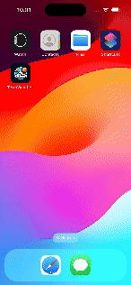

# 🌩️ Terra Weather 
### Overview
Welcome to the TerraWeather App! 

This iOS application serves as take home test for Terra Karya.

## Implementation Details
### Network Layer
The application follows a structured network layer with the following components:

1. NetworkProvider: Handles making requests and returning responses as data or failures in the form of NetworkError.
2. NetworkError: Error for network request and customized description.
3. NetworkProvider+Extension: Provide `endpointClosure` and `requestClosure` for `MoyaProvider`

### Architecture
The app follows the MVVM design pattern with Coordinator and Clean Architecture 

```
- Application
     - Infrastructure
          - Networking
               - NetworkProvider
               - NetworkError
               - NetworkProvider+Extension
     - Data
          - Repository Implementations
          - TargetTypes
          - Payload
     - Domain 
          - Repository
          - Model / Entities
     - Presentation 
          - Commons
          - Scene
               - ViewModel
               - View
                  - ViewState
                  - UIComponents
                  - Actions 
               - Coordinator
               - DependencyInjectionContainer

```


This folder structure organizes the application into clear sections, making it easier for developers to navigate and understand the codebase.

## Getting Started
To start the project, simply open the file TerraWeather.xcodeproj.

## Preview


